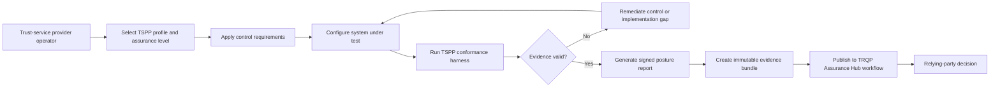

# TSPP assurance execution architecture

The repository previously documented controls, profiles, harness execution, and evidence publication across separate documents without a single end-to-end view. This diagram makes the authority-to-evidence path explicit and identifies the remediation loop.

## Assurance interpretation

The diagram is normative only where it links to an identified specification, schema, profile, or executable test. Each transition should produce inspectable evidence: selected profile identifiers, test inputs, result artifacts, decision records, and publication manifests. Revocation or supersession must be represented by lifecycle data rather than by silently replacing prior evidence.
